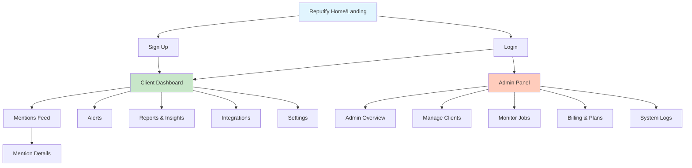

# 🧭 UI Design System - Sitemap & Navigation

**Reputify Reputation Management Platform**

> **Document Purpose:** Complete navigation architecture, user journey maps, page connections, modal flows, and purple theme navigation styling for all user interfaces.
>
> **For:** UI/UX Designers & Information Architects  
> **Last Updated:** November 2025  
> **Part of:** Reputify UI Design System Documentation

---

## Visual Sitemap & Navigation Flow

## HIERARCHICAL SITEMAP



## NAVIGATION FLOW CONNECTIONS

### 🔵 Primary Navigation (Always Visible in Sidebar)

```
Dashboard ←→ Mentions Feed ←→ Alerts ←→ Reports ←→ Integrations ←→ Settings
    ↓              ↓            ↓         ↓            ↓            ↓
[Home View]  [List View]  [Alert List] [Analytics] [Platforms] [Account]
                   ↓
            [Detail View]
```

### 🟢 Cross-Page Connections

1. **From Dashboard:**

   - KPI Cards → Click "View Details" → Reports Page
   - Latest Mentions → Click "View All" → Mentions Feed
   - Alert Summary → Click alert → Alerts Page
   - Platform Status → Click "Configure" → Integrations

2. **From Mentions Feed:**

   - Any mention card → Click "View Details" → Mention Details
   - Filter by platform → Updates URL params → Same page refresh
   - "AI Reply" action → Opens modal → Stay on page

3. **From Mention Details:**

   - Breadcrumb → Back to Mentions Feed
   - Similar Mentions → Another Mention Details
   - "View Original" → External platform URL (new tab)
   - "Approve & Send" → Success toast → Back to feed

4. **From Alerts:**

   - Alert card → Click "Open Details" → Mention Details
   - "Mark Resolved" → Updates status → Stays on Alerts
   - Notification log → Click entry → Shows delivery details

5. **From Reports:**

   - Export buttons → Download file → Stay on page
   - Chart interactions → Filter data → Update visualizations
   - "View Details" on summary → Mentions Feed (filtered)

6. **From Integrations:**

   - "Connect" button → OAuth flow → External → Return to Integrations
   - "Disconnect" → Confirmation modal → Update status
   - "Settings" → Platform-specific config modal

7. **From Settings:**
   - "Upgrade Plan" → Billing modal or new page
   - "Delete Account" → Multi-step confirmation → Logout
   - "Save Changes" → Success toast → Stay on page

### 🔴 Admin Navigation Flow

```
Admin Overview
    ↓
    ├→ Manage Clients → Client Details → Edit Modal
    ├→ Monitor Jobs → Job Details → Logs View
    ├→ Billing & Plans → Plan Editor → Save Changes
    └→ System Logs → Filter View → Export Data
```

## USER JOURNEY MAPS

### Journey 1: First-Time User

```
1. Landing Page (Learn about product)
   ↓
2. Sign Up (Create account)
   ↓
3. Email Verification (Check inbox)
   ↓
4. Welcome Screen (Quick tutorial)
   ↓
5. Integrations (Connect first platform)
   ↓
6. Dashboard (See first data)
```

### Journey 2: Daily Active User

```
1. Login
   ↓
2. Dashboard (Check KPIs)
   ↓
3. Alerts (Review critical items)
   ↓
4. Mention Details (Read full context)
   ↓
5. AI Reply (Edit and send response)
   ↓
6. Mark Resolved
```

### Journey 3: Weekly Reporter

```
1. Login
   ↓
2. Reports Page
   ↓
3. Select Date Range
   ↓
4. View Charts
   ↓
5. Export PDF
   ↓
6. Share with Team
```

### Journey 4: Admin Monitoring

```
1. Admin Login
   ↓
2. Admin Overview
   ↓
3. Monitor Jobs (Check failures)
   ↓
4. Manage Clients (Review usage)
   ↓
5. System Logs (Debug issues)
```

## MODAL & OVERLAY FLOWS

### Modals That Appear Over Pages:

- **Login:** Forgot Password Modal
- **Dashboard:** Quick Actions Modal
- **Mentions:** Filter Settings Modal
- **Details:** Edit Reply Modal
- **Alerts:** Resolve Confirmation Modal
- **Reports:** Export Options Modal
- **Integrations:** Platform Config Modal
- **Settings:** Change Password Modal
- **Admin:** Client Edit Modal

### Toast Notifications (Non-Blocking):

- Success: "Reply sent successfully"
- Error: "Failed to load mentions"
- Info: "New mentions available"
- Warning: "API limit approaching"

## RESPONSIVE NAVIGATION CHANGES

### Desktop (1440px+)

```
[Logo] [────────Sidebar────────] [─────Main Content Area─────] [User Menu]
       Purple tinted BG          White/Dark BG
       Active: Purple gradient
```

### Tablet (768px - 1439px)

```
[☰][Logo]        [─────Main Content Area─────]        [User]
   ↓
[Collapsible Sidebar]
Purple tinted, icons remain visible
```

### Mobile (375px - 767px)

```
[☰][Logo]                                    [🔔][User]
────────────────Content────────────────
[Home][Mentions][Alerts][Reports][More]  <- Bottom Nav
Active item: Purple (#8b5cf6), Others: Gray
```

## 🎨 PURPLE THEME NAVIGATION STYLING

### Sidebar Visual Identity

- **Background:** Light: #faf5ff (subtle purple) | Dark: #1a1a2e (dark purple-gray)
- **Active Item:** Purple gradient background with white text
- **Hover State:** Light: #f3e8ff | Dark: #252542
- **Inactive Items:** Gray text that turns purple on hover

### Top Bar Styling

- **Option 1 - Premium:** Purple gradient background (#720e9e → #a855f7)
- **Option 2 - Minimal:** White/Dark with purple accent border
- **User Menu:** Purple hover effect
- **Notifications:** Purple badge for unread count

### Breadcrumbs

- **Current Page:** Royal purple (#8b5cf6) and bold
- **Previous Pages:** Gray with purple on hover
- **Separator:** Light gray chevron

### Active State Indicators

- **Purple Dot:** Small circle for mobile bottom nav
- **Purple Border:** Left border (4px) on sidebar active item
- **Purple Underline:** Bottom border for tab navigation

## ERROR STATE NAVIGATION

When errors occur, users can:

- **Network Error:** → Show retry button → Retry action → Success/Fail
- **404 Page:** → Show "Go to Dashboard" → Dashboard
- **Permission Error:** → Show "Request Access" → Contact Admin
- **Session Expired:** → Auto redirect → Login Page

## BREADCRUMB PATTERNS

```
Level 1: Dashboard
Level 2: Dashboard > Mentions
Level 3: Dashboard > Mentions > Details
Level 2: Dashboard > Settings
Level 3: Dashboard > Settings > Billing

Admin:
Level 1: Admin
Level 2: Admin > Clients
Level 3: Admin > Clients > Client Details
```

## STATE PRESERVATION

Pages that maintain state during navigation:

- **Mentions Feed:** Filters, search, scroll position
- **Reports:** Selected date range, chart type
- **Admin Clients:** Sort order, search term
- **System Logs:** Filter settings, date range

Pages that reset on navigation:

- **Dashboard:** Always fresh data
- **Alerts:** Always current alerts
- **Mention Details:** Specific to ID

## DEEP LINKING SUPPORT

URLs that can be bookmarked/shared:

- `/mentions?platform=facebook&sentiment=negative`
- `/mentions/[id]` - Specific mention
- `/reports?range=30d&platform=all`
- `/admin/clients/[client-id]`
- `/admin/jobs?status=failed`

## NAVIGATION ACCESSIBILITY

### Keyboard Navigation:

- Tab through all interactive elements
- Enter to activate buttons/links
- Escape to close modals
- Arrow keys for dropdowns

### Screen Reader Landmarks:

- Main navigation
- Page header
- Main content
- Sidebar
- Footer

### Focus Management:

- Auto-focus first form field
- Trap focus in modals
- Return focus after modal close
- Skip to main content link

---

This sitemap and navigation flow provides:
✅ Complete page hierarchy
✅ All navigation connections
✅ User journey paths
✅ Modal and overlay behaviors
✅ Responsive navigation changes
✅ State management rules
✅ Deep linking structure

Your UI team now has a complete blueprint of how every screen connects and how users will flow through the application!
